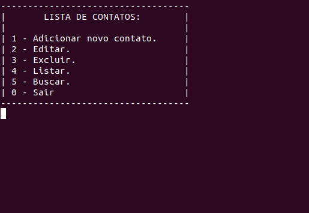

# Contact_List_Software

 This project is a terminal based contact list program built by Olavo Nascimento (olavo.nascimento4@gmail.com), Vitor G. S. Ruffo and Wellinton Piassa (wellintonpiassa@hotmail.com) in C language. It was made as an assignment for the programming first-year discipline of the State University of Londrina's Computer Science course.

It allows you to add new contacts, edit or delete an existing contact, list all contacts, and search for a specific one by provinding its name. The contacts are saved on a file, on the same directory as the program, so that you don't loose data when finishing the program. It took us more or less one month to finish that assignment.
 

#### See some [screenshots](project-screenshots) of the program.
